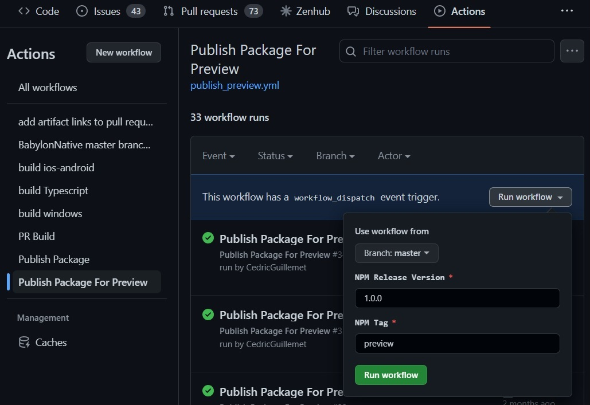
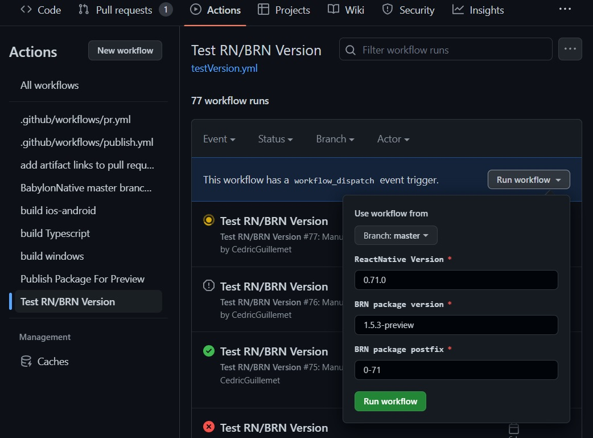
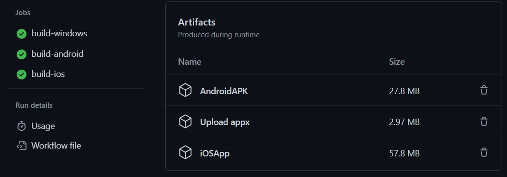

# Testing BabylonReactNative Packages

Building and testing on every platform can be time consuming.
Moreover, it's pretty common to not have all the tools and/or build platforms.
For easier and faster development, it's possible to test an existing NPM package against a version of ReactNative.

- For new feature/dependencies update and you want a quick test to verify it's still working
- Test an existing BRN NPM package against a new React-Native release

## Releasing preview package

To release a new .APK with the `Publish Package for Preview` Github Action.
Select a branch on the main repo, the NPM version with the `-preview` name and Run Workflow.


## Building Apps for Windows, Android and iOS

The `Test RN/BRN version` will create a sample playground using the intended React-Native version and with the Babylon React Native version specified in the parameters. 



After some time (around 1hour), test packages are available for Windows, Android, iOS.



### Testing on Windows

Download and unzip Appx artifact. There is an installer inside named:
```
Playground_1.0.0.0_x64.appx
```

Run it and application should be installed and can then be tested.

### Testing on iOS

Download and unzip iOSApp. It constains an `.xcarchive`. 
Boot up the simulator with an iOS image. When it's ready, open a terminal and type this command:
```
xcrun simctl install booted Path_to_the_xcarchive/Products/Applications/Playground
```
After a few seconds, the application icon should be visible in the dashboard.
Tap to run.

### Testing on Android

Download and unzip AndroidAPK. It constains an `app-release.apk`.
With `abd`, install the application from a terminal:
```
adb install path_to/app-release.apk
```
Then, run the app with:
```
adb shell am start -n com.playground/.MainActivity
```

