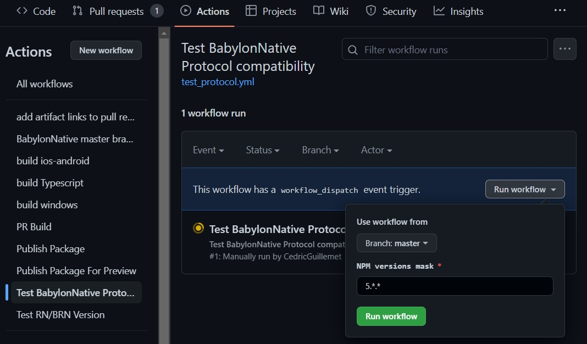

# Testing BabylonNative Protocol

`Apps/TestProtocol` is a semi-automated tool to test compatibility between BabylonReactNative (more specificaly BabylonNative)
and Babylon.js NPM packages.
It checkouts, build and run validation tests for every BabylonNative hash version from a list and every Babylon.js NPM package.
NPM Package version must correspond to a mask provided to the script.

## Testing localy

Testing takes time and multiple windows get opened and closed. This will make working in parrallel a bit difficult. Best is to leave running script without using the PC.

Clone BabylonReactNative repo then :
```
cd Apps/TestProtocol
npm i
npm run testPackages
```

Result is a JSON file named `compatibility.json`.

## Testing on CI

Go to GitHub Action.



Result is the same .JSON as earlier than can be download as an artifact

## Results

Resulting JSON is an array that contains a list of Babylon.js NPM versions compatible with the BabylonNative commit hash.
There is a 1-1 link between a BabylonReactNative released version and a BabylonNative commit.

Note: The script test is very restrictive. Any protocol version mismatch, a crash, a bad Validation test ,... will result in that specific version to not be compatible.
This means that a version marked as compatible is sure to run, at least, all the validation tests.